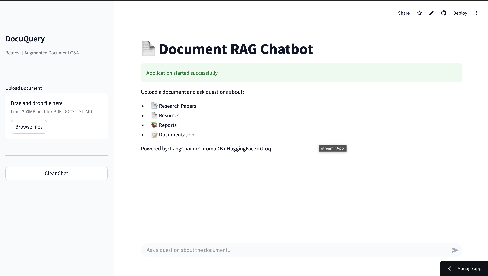

# 📄 DocuQuery — Chat With Your Documents, Backed by Real Sources

**Ask questions about any PDF, DOCX, or TXT file and get answers with the exact source chunks that prove them — no hallucinations, no guessing.**

[](https://github.com/Dharunmd/rag-document-chatbot/actions/workflows/ci.yml)
[](LICENSE)
[](https://www.python.org/downloads/release/python-3110/)
[](https://rag-document-chatbot-mtkgf2ug7veksbd8mcsf2s.streamlit.app)
[](https://github.com/Dharunmd/rag-document-chatbot/stargazers)

**[🚀 Try the live demo](https://rag-document-chatbot-mtkgf2ug7veksbd8mcsf2s.streamlit.app)** · **[⭐ Star this repo](#)** if it's useful to you — it helps others discover it too.

---

### 🎬 See it in action

[▶ Watch Demo Video](docs/rag_chatbot.mp4)




---

## Why DocuQuery?

Generic chatbots (and copy-pasting into ChatGPT) make things up when they don't know the answer. DocuQuery only answers from **your** document, and shows you the exact passage it used — so you can verify every answer in one click.

## ✨ Features

- 📂 **Multi-format ingestion** — PDF, DOCX, TXT, Markdown
- 🔍 **MMR retrieval** — diverse, non-redundant context chunks (ChromaDB)
- 🧠 **Free local embeddings** — HuggingFace `all-MiniLM-L6-v2`, no embedding API cost
- ⚡ **Gemini 2.0 Flash** — fast, cheap, accurate generation
- 📌 **Source-cited answers** — every response shows the chunk it came from
- 🚫 **Grounded refusal** — says "I don't know" instead of hallucinating
- 🐳 **One-command Docker deploy**
- ✅ **CI-tested** with pytest + GitHub Actions

## 🏗 Architecture

```text
Upload (PDF/DOCX/TXT/MD)
        │
        ▼
  Document Loader ──▶ Text Splitter (1000 chars / 200 overlap)
        │
        ▼
  HuggingFace Embeddings ──▶ ChromaDB (persisted vector index)
        │
User Question ──▶ Query Embedding ──▶ MMR Retriever (k=4)
        │
        ▼
  Gemini 2.0 Flash + grounded prompt ──▶ Answer + cited source chunks
```

## 🚀 Quick Start (5 minutes)

```bash
git clone https://github.com/Dharunmd/rag-document-chatbot.git
cd rag-document-chatbot
python3 -m venv venv && source venv/bin/activate
pip install -r requirements.txt

cp .env.example .env
# Add your free GOOGLE_API_KEY from https://aistudio.google.com/app/apikey

streamlit run app.py
```

Open **http://localhost:8501** → sidebar → **Load sample** → ask: *"What is this document about?"*

### 🐳 Or run with Docker

```bash
cp .env.example .env   # add your API key
docker compose up --build
```

### ☁️ Or skip setup entirely

**[Try the hosted demo →](https://rag-document-chatbot-mtkgf2ug7veksbd8mcsf2s.streamlit.app)**

## 💬 Usage Example

```python
from src.pipeline import RAGPipeline

rag = RAGPipeline()
rag.index_document("data/samples/sample.pdf")
result = rag.query("What were the key findings?")

print(result["answer"])
print(result["sources"])  # exact chunks used
```

## 🧰 Tech Stack

Python 3.11 · Streamlit · LangChain · ChromaDB · sentence-transformers · Google Gemini API · Docker · GitHub Actions

## 📂 Project Structure

```text
rag-document-chatbot/
├── app.py                  # Streamlit frontend
├── config.py                # Environment-driven settings
├── src/
│   ├── document_loader.py   # Parsing + chunking
│   ├── embeddings.py        # Cached HuggingFace model
│   ├── vector_store.py      # Chroma indexing
│   ├── retriever.py         # MMR retrieval
│   ├── llm_chain.py         # Gemini QA chain
│   └── pipeline.py          # Index + query orchestration
├── tests/                   # Pipeline unit tests
├── data/samples/             # Demo document
├── Dockerfile
└── docker-compose.yml
```

## ❓ FAQ

**Does it work with scanned PDFs?**
Not yet — scanned (image-only) PDFs need OCR, which isn't implemented. Text-layer PDFs work fine.

**Can I use a different LLM instead of Gemini?**
The `llm_chain.py` module is the only place tied to Gemini — swapping in OpenAI/Claude/Ollama is a small change. PRs welcome.

**Is my document data stored anywhere?**
No — ChromaDB is persisted locally/in your deployment only. Nothing is sent anywhere except the retrieved chunks to the Gemini API for answer generation.

**Can I query multiple documents at once?**
Not yet — currently single-document mode. Multi-doc collections are on the roadmap.

## 🗺 Roadmap

- [ ] Multi-document collections
- [ ] OCR support for scanned PDFs
- [ ] Persistent chat history
- [ ] Pluggable LLM backend (OpenAI / Claude / local models)
- [ ] Citation highlighting in the UI

## 🤝 Contributing

Contributions are welcome! Good first issues are tagged [`good first issue`](https://github.com/Dharunmd/rag-document-chatbot/labels/good%20first%20issue).

1. Fork the repo
2. Create a branch: `git checkout -b feature/your-feature`
3. Commit and push
4. Open a PR

## 📋 Resume Bullet (for students using this as a portfolio project)

> **DocuQuery — RAG Document Q&A System** | Python, LangChain, ChromaDB, Gemini
> Built an end-to-end retrieval-augmented generation app indexing PDF/DOCX/TXT documents into ChromaDB with HuggingFace embeddings; answers queries via Google Gemini using MMR retrieval and inline source attribution. Deployed with Streamlit and Docker, with CI via pytest + GitHub Actions.

## ⭐ Found this useful?

If DocuQuery helped you, learn from it, or saved you time — **please star the repo**. It genuinely helps other students and developers find it.

## Author

**Dharun M** · [GitHub](https://github.com/Dharunmd)

## License

MIT — see [LICENSE](LICENSE)
